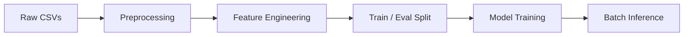

# mlops2025_Lynn_Hadi

## Overview
End-to-end MLOps pipeline for taxi trip duration prediction, covering
data preprocessing, feature engineering, model training, evaluation,
and experiment tracking.

---
## Project Structure

```
mlops2025_Lynn_Hadi/
├── Dockerfile
├── docker-compose.yml
├── Makefile
├── README.md
├── pyproject.toml
├── uv.lock
├── main.py

├── scripts/
│   ├── preprocess.py
│   ├── feature_engineering.py
│   ├── train.py
│   └── batch_inference.py

├── src/
│   ├── mlproject/
│   │   ├── __init__.py
│   │   ├── data/
│   │   ├── preprocess/
│   │   ├── features/
│   │   ├── train/
│   │   ├── inference/
│   │   ├── pipelines/
│   │   └── utils/
│   └── mlproject.egg-info/

├── configs/
└── tests/
```
---
## Setup Instructions
### Clone the repository
``` bash
git clone https://github.com/lynn511/mlops2025_Lynn_Hadi.git
cd mlops2025_Lynn_Hadi
```
Install uv if you don't have it.

### Create the environment and install dependencies

``` bash
uv sync
```
This creates a local virtual environment and installs all required dependencies from pyproject.toml.
### Notes 
Python version and dependencies are managed by uv

No manual virtual environment activation is required

MLflow runs locally by default

---
## Pipeline Execution (Makefile)


This project uses a Makefile to orchestrate the ML pipeline.
### The pipeline 


### Available Commands
```bash 
make preprocess
```
Cleans raw training and test data and writes processed CSV files.

```bash
make features
```

Generates features and splits data into train and evaluation sets.

```bash
make train
```
Trains the selected model and saves it locally (no experiment tracking).
```bash
make train-mlflow
```

Trains the model while logging parameters, metrics, and artifacts to MLflow.
```bash
make batch_inference
```

Runs batch inference on the test dataset and outputs predictions (in minutes).

```bash
make all
```
Runs preprocessing+feature engineering+training.

```bash
make full
```
Runs the complete pipeline including batch inference.
```bash
make full-mlflow
```
Runs the complete pipeline with MLflow experiment tracking enabled.
```bash
make clean
```
Removes all generated artifacts, models, and intermediate data.
### Notes: 
The best performing model is the XGBoost, we chose it as the default model.
if you want to experiment with the linear Regression model:
```bash
make train MODEL_TYPE=linear
```
Prediction unit is in minutes.

---

## Experiment Tracking (MLflow)
This project uses MLflow to track and compare machine learning experiments in a reproducible way.

```md
What is tracked:

- Models: Linear Regression, XGBoost
- Metrics: RMSE, MAE, R²

```
How it works

MLflow is integrated directly into the training script (train.py).
Each model run is logged as a separate MLflow run under the same experiment.
MLflow enables reproducibility, model comparison, and experiment auditing
without modifying the core training logic.


## Launch MLflow UI
```bash
uv run mlflow ui
```

then open: 
```bash
http://127.0.0.1:5000
```
## Results

MLflow enables easy comparison between models.
In this project, XGBoost outperforms Linear Regression across all evaluation metrics.


