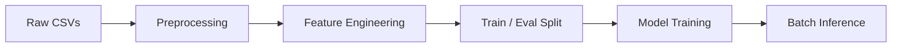
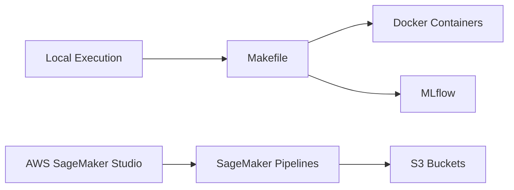

# mlops2025_Lynn_Hadi

## Overview
End-to-end MLOps project for taxi trip duration prediction using the New York City Taxi dataset.
The project implements a complete machine learning pipeline covering preprocessing, feature engineering, training, evaluation, batch inference, and cloud execution, following the tools and practices covered in the MLOps course.

Task: Regression – predict trip_duration.

---
## Project Structure

```
mlops2025_Lynn_Hadi/
├── Dockerfile
├── docker-compose.yml
├── Makefile
├── README.md
├── pyproject.toml
├── uv.lock
├── main.py
├── mlflow.db
├── mlruns
├── pyproject.toml
├── run_batch_inference_pipeline.py
├── run_training_pipeline.py

├── models
│   ├── trained_model.dv.pkl
│   ├── trained_model.metrics.json
│   └── trained_model.pkl

── outputs
│   └── 20260104_predictions.csv

├── scripts/
│   ├── preprocess.py
│   ├── feature_engineering.py
│   ├── train.py
│   └── batch_inference.py

├── src/
│   ├── mlproject/
│   │   ├── __init__.py
│   │   ├── data/
│   │   ├── preprocess/
│   │   ├── features/
│   │   ├── train/
│   │   ├── inference/
│   │   ├── pipelines/
│   │   └── utils/
│   └── mlproject.egg-info/

├── configs/
└── tests/
```
The project follows a src/ layout, with each pipeline stage implemented as a separate module and script.

---
## Setup Instructions
### Clone the repository
``` bash
git clone https://github.com/lynn511/mlops2025_Lynn_Hadi.git
cd mlops2025_Lynn_Hadi
```
Install uv if you don't have it.

### Create the environment and install dependencies

``` bash
uv sync
```
This creates a local virtual environment and installs all required dependencies from pyproject.toml.
### Notes 
Python version and dependencies are managed by uv

No manual virtual environment activation is required

MLflow runs locally by default

---
## Pipeline Execution (Makefile)

The ML pipeline is orchestrated locally using a Makefile.
### Pipeline Overview

### Available Commands
```bash 
make preprocess
```
Cleans raw training and test data and writes processed CSV files.

```bash
make features
```

Generates features and splits data into train and evaluation sets.

```bash
make train
```
Trains the selected model and saves it locally (no experiment tracking).
```bash
make train-mlflow
```

Trains the model while logging parameters, metrics, and artifacts to MLflow.
```bash
make batch_inference
```

Runs batch inference on the test dataset and outputs predictions (in minutes).

```bash
make all
```
Runs preprocessing+feature engineering+training.

```bash
make full
```
Runs the complete pipeline including batch inference.
```bash
make full-mlflow
```
Runs the complete pipeline with MLflow experiment tracking enabled.
```bash
make clean
```
Removes all generated artifacts, models, and intermediate data.

---
## Model Selection and Metrics
Two models were implemented and compared:

- Linear Regression

- XGBoost Regressor

### Evaluation metrics:RMSE, MAE,R²

Metric choice:
RMSE is used as the primary metric because it penalizes large errors more heavily, which is important for trip duration prediction.

### Model choice:
XGBoost consistently outperformed Linear Regression across all metrics and was selected as the default model.

To experiment with Linear Regression:
```bash
make train MODEL_TYPE=linear
```
Prediction unit is in minutes.

---
## Experiment Tracking (MLflow)
MLflow is used to track experiments during local training.

```md
What is tracked:

- Models: Linear Regression, XGBoost
- Metrics: RMSE, MAE, R²

```
MLflow is integrated directly in train.py.

## Launch MLflow UI
```bash
uv run mlflow ui
```

then open: 
```bash
http://127.0.0.1:5000
```
## Results

MLflow enables easy comparison between models.

In this project, XGBoost outperforms Linear Regression across all evaluation metrics.


---
## Docker Execution (Mandatory)

### Dockerfile

-Uses Python 3.11

-Installs dependencies using uv

-Installs the mlproject package

-Supports training and inference execution
### Docker Compose
docker-compose.yml orchestrates the application and optional MLflow service.
example usage:
``` bash 
docker-compose run app train
docker-compose run app inference
```
The same pipeline logic works locally and inside docker containers


---
## AWS SageMaker Pipeline (Studio + S3)
This project implements AWS SageMaker pipelines for cloud execution, developed and executed using SageMaker Studio.

### Pipelines implemented:

#### Training pipeline:

Preprocessing

Feature engineering

Model training

Model artifact output to S3

#### Batch inference pipeline:

Takes raw CSV input

Runs preprocessing and feature engineering

Loads the trained model

Runs batch inference

Writes predictions to S3

### S3 Usage

Amazon S3 is used to store:

-Input datasets

-Intermediate processed data

-Model artifacts

-Batch inference outputs

All pipeline steps exchange data through S3.


### Code location
``` bash 
src/mlproject/pipelines/
```
The same codebase is reused across local, Docker, and SageMaker executions.

---



Docker was used only for local execution.
SageMaker pipelines run natively on AWS infrastructure without Docker-based execution.

---

# Team Contributions:
A significant portion of the development was done collaboratively during live meetups.

### Lynn el Moussaoui:
- Initial project structure and packaging (`src/` layout)
- Data splitting logic and leakage prevention
- Docker setup and image configuration
- Makefile pipeline orchestration
- MLflow integration for experiment tracking
- AWS SageMaker pipeline definition and execution

### Hadi Cheayto:
- Feature engineering implementation (time-based and distance-based features)
- Model training and evaluation for Linear Regression and XGBoost
- Batch inference implementation and prediction output handling
- Docker Compose configuration for local pipeline execution
- Contribution to AWS SageMaker pipeline components
- Refactoring final code logic
